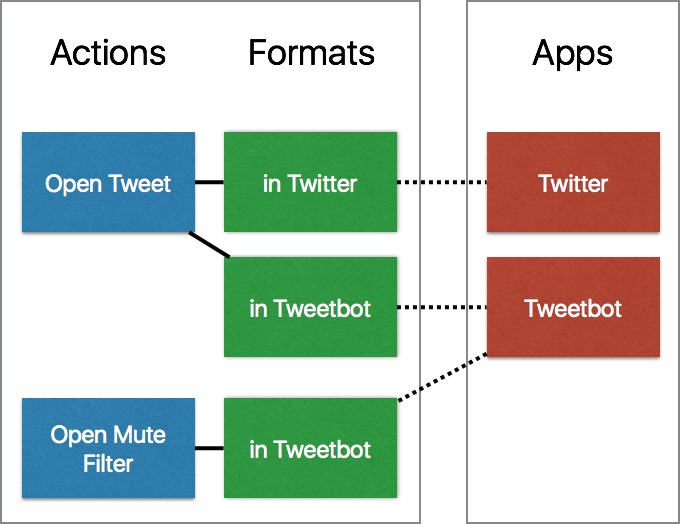

# Opener Manifest

[Opener](http://www.opener.link) is an app for iOS that allows people to open web links in native apps instead. It does so by transforming web links within an engine powered by a rule set. This repo is the public version of that rule set.

## Overview

There are four main entities (apps, actions, formats, and browsers) under three top level keys (`apps`, `actions`, and `browsers`) that define a many-to-many relationship between web URLs and the apps they can be opened in.



Actions contain formats as child dictionaries, and formats are matched with apps through identifiers. Browsers contain keys from each of the action, app, and format constructs and are intended to be capable of handling any http or https URL as an input.

## Apps

The `apps` top level key in the manifest contains an ordered list of dictionaries, each representing an app supported by Opener. Each app contains the following fields

<table>
<tr><th>Key</th><th>Type</th><th>Description</th></tr>
<tr><td><code>identifier</code></td><td>string</td><td>A human-readable identifier for this app, used elsewhere in the manifest.</td></tr>
<tr><td><code>displayName</code></td><td>string</td><td>The user-facing name for this app within Opener.</td></tr>
<tr><td><code>storeIdentifier</code></td><td>number as string</td><td>The identifier of the app on the App Store. (Optional in v2, required in v1)</td></tr>
<tr><td><code>iconURL</code></td><td>URL string</td><td>A URL to an icon for this app, mutually exclusive with <code>storeIdentifier</code>. This is intended for first party app support.</td></tr>
<tr><td><code>scheme</code></td><td>URL string</td><td>A URL containing only the scheme that will open this app.</td></tr>
<tr><td><code>new</code></td><td>bool</td><td>Indicates whether or not this app will be include in the "New Apps" group in Opener.</td></tr>
<tr><td><code>platform</code></td><td>string</td><td>Specifies if this app should only show up on iPhone/iPod Touch (value=<code>phone</code>) or on iPad (value=<code>pad</code>), shows on both if unspecified. (Opener 1.0.1 and above)</td></tr>
<tr><td><code>country</code></td><td>string</td><td>If the app isn't globally available, including a country code in which it is available in this field will allow the app's icon to show regardless of the user's store. (Opener 1.1.1 and above)</td></tr>
</table>

For example, if Opener were to include itself as an app

```
{
	"identifier": "opener",
	"storeIdentifier": "989565871",
	"displayName": "Opener",
	"scheme": "opener://",
	"new": true
}
```


## Actions

The `actions` top level key in the manifest contains a list of dictionaries, each corresponding to a web URL-to-native URL rule. There's a many-to-many relationship between the values in `actions` and `apps`.

### Common values

<table>
<tr><th>Key</th><th>Type</th><th>Description</th></tr>
<tr><td><code>title</code></td><td>string</td><td>The user-facing title for this action.</td></tr>
<tr><td><code>regex</code></td><td>string</td><td>A regular expression string that the input URL is matched against. If this regex is matched by Opener for a given input, this action will appear in the list of available opening options.</td></tr>
<tr><td><code>includeHeaders</code></td><td>bool</td><td>Indicates if headers should be included in the string that <code>regex</code> is matched with. If <code>true</code>, the headers are included in the input as a JSON encoded string separated from the input URL by a newline. (Opener 1.0.2 and above)</td></tr>
<tr><td><code>formats</code></td><td>array of dictionaries</td><td>Specifies the apps that an action can be opened in (see <a href="#formats">below</a>).</td></tr>
</table>

### <a tag="#formats">Formats</a>

Because an action could taken in multiple apps, there's an array within each action dictionary named `formats`. Each entry in this array matches the input URL with an app-specific output for the given action. Each of these contains the following keys.

<table>
<tr><th>Key</th><th>Type</th><th>Description</th></tr>
<tr><td><code>appIdentifier</code></td><td>string</td><td>The identifier of the app that this action applies to. Should match the <code>identifier</code> of an app.</td></tr>
<tr><td><code>format</code></td><td>string</td><td>The regex template applied to the input. Mutually exclusive with <code>script</code>.</td></tr>
</table>

### Advanced URL generation in formats

Some app native URLs can't be generated using simple regex templating, they require lookups or encoding of some sort. To do this, action formats can provide Javascript methods that are executed to convert input URLs to app native action URLs.

<table>
<tr><th>Key</th><th>Type</th><th>Description</th></tr>
<tr><td><code>script</code></td><td>Javascript string</td><td>Mutually exclusive with <code>format</code>.</td></tr>
</table>

This script must contain a Javascript function named `process` that takes two inputs, a URL and an anonymous function to be called upon completion. Once complete, the completion handler should be called passing the result or `null` on failure.

For example

```
function process(url, completionHandler) {
	// do something with URL...
	url = rot13(url);
	
	completionHandler(url);
}
```

Opener enforces a timeout of 15 seconds if `completionHandler` isn't called.

#### Common scenarios

If you're planning on using the **Twitter Cards** tags embedded on a page, you should isolate the app's URL scheme and do something like this, which is used for [Swarm](https://www.swarmapp.com/).

```
function process(url, completionHandler) { var xmlhttp = new XMLHttpRequest(); xmlhttp.onreadystatechange = function() { if (xmlhttp.readyState == 4 && xmlhttp.status == 200) { var res = xmlhttp.responseText; var regex = RegExp('.*(swarm:\/\/.*?)\".*'); var match = regex.exec(res)[1]; completionHandler(match); } }; xmlhttp.open('GET', url, true); xmlhttp.send(); }
```

If you need to **URL encode** something, here's an example for [Overcast](https://overcast.fm/).

```
function process(url, completionHandler) { completionHandler('overcast://x-callback-url/add?url=' + encodeURIComponent(url)); }
```

If you need to pick a component out of the URL passed in, you can use the Javascript `RegExp` class.

### Testing

To keep Opener maintainable, tests for actions can and should be provided.

At the `action` level:

<table>
<tr><th>Key</th><th>Type</th><th>Description</th></tr>
<tr><td><code>testInputs</code></td><td>array of strings</td><td>An array of test inputs that will be run against <code>regex</code> then each action.</td></tr>
</table>

At the `format` level:

<table>
<tr><th>Key</th><th>Type</th><th>Description</th></tr>
<tr><td><code>testResults</code></td><td>array of strings or nulls</td><td>An array of expected results for this format for each of the test inputs. <code>null</code> should be used to specify that a test input <i>should not</i> match</td></tr>
</table>

For example

```
{
	...
	"regex": "http(?:s)?://(?:www\\.)?foo\.bar/(\\d+).*$",
	"testInputs": [
		"https://foo.bar/1234"
		"http://www.foo.bar/wat"
	],
	"formats": [
		{
			...
			"format": "foo-app://entry/$1",
			"testResults": [
				"foo-app://entry/1234",
				null
			]
		},
		{
			...
			"script": "function process(url, completion) { completion('bar-app://' + encodeURIComponent(url)); }",
			"testResults": [
				"bar-app://https%3A%2F%2Ffoo.bar%2F1234",
				null
			]
		}
	]
}
```

Testing formats that have `includeHeaders` is not currently possible.

## Browsers

Support for opening any http or https URL in browsers was added in Opener 1.1. Browsers live under the `browsers` top level key, each one contains a subset of the keys from the other `app`, `action`, and `format` dictionaries.

<table>
<tr><th>Key</th><th>Type</th><th>Description</th></tr>
<tr><td><code>identifier</code></td><td>string</td><td>A human-readable identifier for this app, used elsewhere in the manifest.</td></tr>
<tr><td><code>displayName</code></td><td>string</td><td>The user-facing name for this app within Opener.</td></tr>
<tr><td><code>storeIdentifier</code></td><td>number as string</td><td>The identifier of the app on the App Store. (Optional in v2, required in v1)</td></tr>
<tr><td><code>iconURL</code></td><td>URL string</td><td>A URL to an icon for this app, mutually exclusive with <code>storeIdentifier</code>. This is intended for first party app support.</td></tr>
<tr><td><code>scheme</code></td><td>URL string</td><td>A URL containing only the scheme that will open this app.</td></tr>
<tr><td><code>new</code></td><td>bool</td><td>Indicates whether or not this app will be include in the "New Apps" group in Opener.</td></tr>
<tr><td><code>platform</code></td><td>string</td><td>Specifies if this app should only show up on iPhone/iPod Touch (value=<code>phone</code>) or on iPad (value=<code>pad</code>), shows on both if unspecified. (Opener 1.0.1 and above)</td></tr>
<tr><td><code>country</code></td><td>string</td><td>If the app isn't globally available, including a country code in which it is available in this field will allow the app's icon to show regardless of the user's store. (Opener 1.1.1 and above)</td></tr>
<tr><td><code>regex</code></td><td>string</td><td>A regular expression string that the input URL is matched against, used for pattern replacements.</td></tr>
<tr><td><code>format</code></td><td>string</td><td>The regex template applied to the input. Mutually exclusive with <code>script</code>.</td></tr>
<tr><td><code>script</code></td><td>Javascript string</td><td>Mutually exclusive with <code>format</code>.</td></tr>
<tr><td><code>testInputs</code></td><td>array of strings</td><td>An array of test inputs that will be run against <code>regex</code> then each action.</td></tr>
<tr><td><code>testResults</code></td><td>array of strings or nulls</td><td>An array of expected results for this format for each of the test inputs. <code>null</code> should be used to specify that a test input <i>should not</i> match</td></tr>
</table>

For example, here's Google Chrome's dictionary:

```
{
    "displayName": "Chrome",
    "identifier": "chrome",
    "scheme": "googlechrome://",
    "storeIdentifier": "535886823",
    "regex": "http(s)?(.*)$",
    "format": "googlechrome$1$2",
    "testInputs": [
        "http://www.opener.link/",
        "https://twitter.com/openerapp"
    ],
    "testResults": [
        "googlechrome://www.opener.link/",
        "googlechromes://twitter.com/openerapp"
    ]
}
```

## Minify Script

There's a python script included named [minify.py](./minify.py), this script takes a copy of the manifest as an input and outputs a file with suffix '-minified.json' as output. This script strips out all unnecessary keys for Opener's operation when running in the client (testing, documentation, etc.) and minifies the JSON to be compact.

Sample usage:

```
python minify.py openerManifest-v2.json
```

## Versions

The manifest file has a `-v2` on the end, this indicates the major version of the manifest. If there are ever changes to the app that make the manifest not backwards compatible with a former version, the suffix of the manifest file is bumped.

<table>
<tr><th>Manifest Version</th><th>App Version</th><th>Changes</th></tr>
<tr><td>v2</td><td>1.0.10</td><td>Made app dictionary <code>storeIdentifier</code> field optional. This was required in v1. Change was made in order to support first party apps, which lack an iTunes identifier.</td></tr>
</table>

## Contributing

Pull requests are welcome! Because Opener is a closed source app with an experience that I'd like to keep great, I'm going to be pedantic about these requests. I will likely manipulate the order of the apps and actions that are added, and handle the `new` flag for them.
